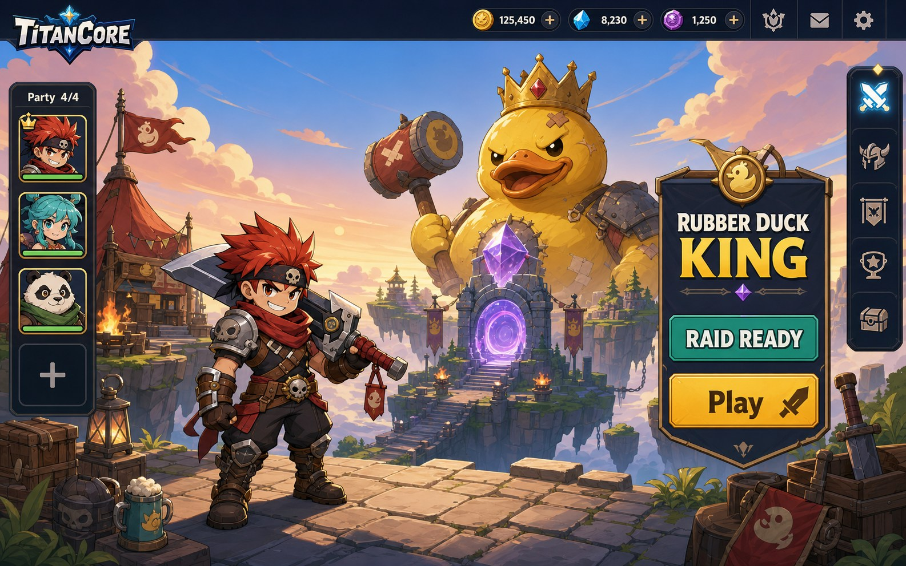
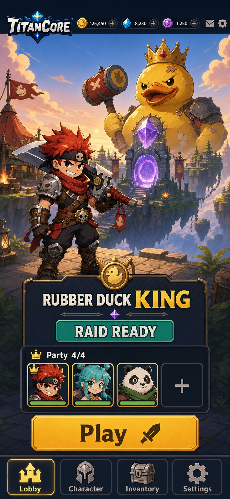
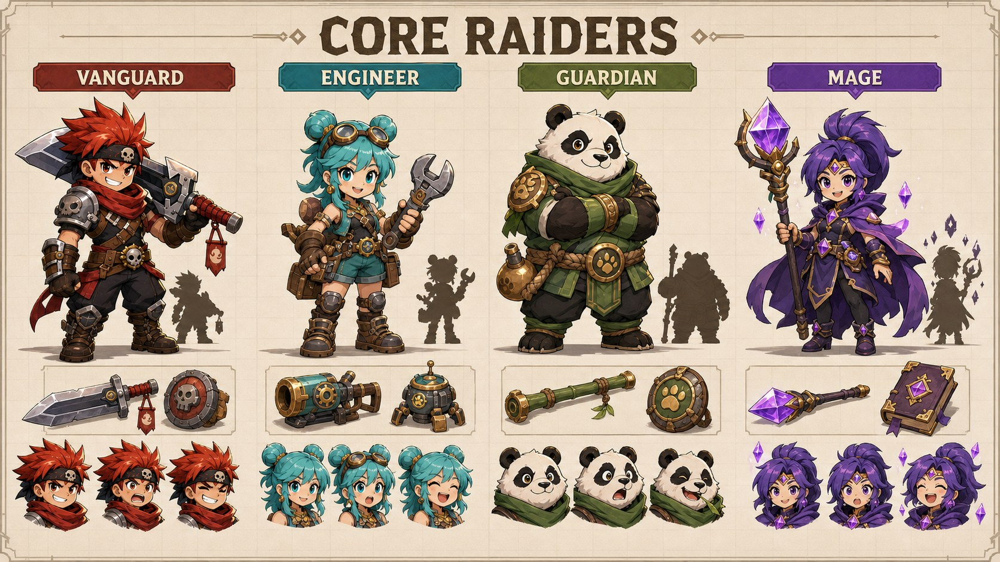
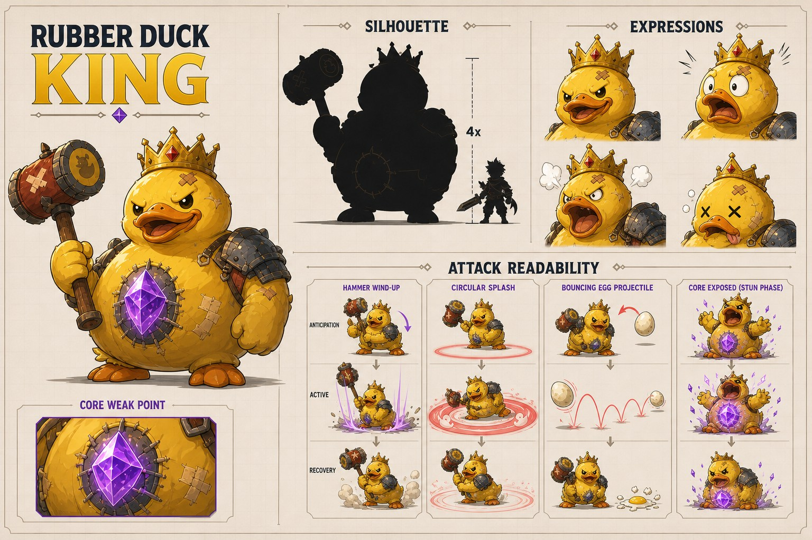
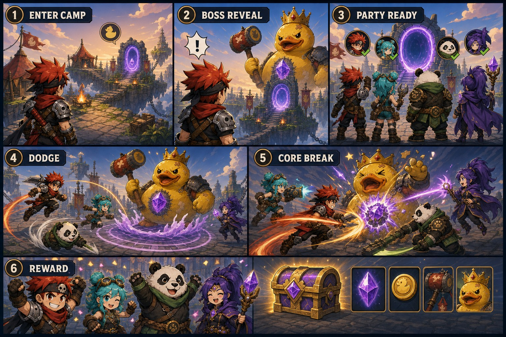

# TitanCore Integrated Creative Target Pack

## Status And Authority

This document records the owner-approved creative target for TitanCore. It
aligns narrative, visual design, audio direction, performance, and the first
playable slice. It does not approve application code, gameplay mechanics,
production assets, storage infrastructure, migrations, APIs, Admin UI, or
provider dependencies.

The owner-approved decisions are:

1. React continues to own the lobby and Three.js remains world-gameplay-only.
2. The Phase 4.2 lobby frontend branch is a technical prototype, not the final
   visual baseline.
3. The player-facing lobby uses a scene-first Raid Camp Adventure direction.
4. AI output is draft material and requires human review and production polish.
5. TitanCore proves quality with one complete vertical slice before expanding
   content breadth.

Story, visual quality, audio quality, player experience, and performance are
co-equal production requirements. A technically working feature is not complete
when it fails the approved experience target.

## Creative Promise

TitanCore is a premium 2D browser co-op boss game that casual players can
understand within one minute. The player should immediately perceive:

- who their hero is;
- which boss is threatening the current destination;
- how to form or join a party;
- which action starts the raid;
- why the boss is funny and memorable;
- what success will reward;
- whether the game is loading, offline, reconnecting, or ready.

The experience is colorful, expressive, cooperative, and comedic. It is not a
generic dashboard with fantasy decoration, and it is not a visual-effects demo
that hides gameplay state.

## Visual Target References

These references establish composition, silhouette, mood, and production
quality. They are AI-assisted drafts, not approved runtime assets. Text,
currencies, controls, and equipment shown in a reference do not create product
requirements or authorize fabricated data.

The `Party 4/4` label and four visible portraits are composition examples only.
They do not change the approved first-room target of eight players. Final party,
room, capacity, and eligibility presentation must use the later authoritative
room contract.

### Desktop Raid Camp



The desktop target demonstrates:

- a full-bleed world as the primary surface;
- a visible featured boss and destination portal;
- one dominant raid decision;
- compact identity, party, navigation, and equipment support;
- strong foreground, middle-distance, and background separation;
- UI that frames the world instead of replacing it.

### Mobile Raid Camp



The mobile target demonstrates:

- portrait-first composition rather than a squeezed desktop layout;
- boss, hero, raid status, party, and primary action in a clear sequence;
- large touch targets and safe-area-aware navigation;
- fewer decorative layers without losing character or quality;
- no small desktop sidebars or unreadable secondary text.

### Core Raider Lineup



The lineup is a visual identity study. Vanguard, Engineer, Guardian, and Mage
labels describe presentation archetypes only. They do not approve combat
classes, statistics, abilities, equipment rules, or party-role requirements.

### First Boss Target



The Rubber Duck King is the first-slice creative target because it provides:

- a recognizable silhouette at card and combat scale;
- an immediate comedic premise;
- a crown, hammer, and Core weak point with distinct shapes;
- expressive reactions and a non-gory defeat;
- readable anticipation, active, and recovery poses;
- a strong foundation for a memorable sound identity.

The attack thumbnails are readability studies. Exact timings, hit areas,
damage, cooldowns, and mechanics require a later combat-design approval.

## Scene-First Lobby Contract

The final lobby is a place the player inhabits, not a collection of floating
application panels.

### World Layer

The Raid Camp owns most of the viewport:

1. Static sky and distant world.
2. Camp structures, destination, boss reveal, and portal.
3. Foreground platform, player hero, and a bounded number of props.

Desktop may animate at most three decorative depth layers. Mobile LOW uses one
decorative layer. REDUCED uses no looping decorative movement.

### Interface Layer

React provides:

- player identity and account-safe actions;
- allowlisted navigation;
- featured raid information from published content;
- party or room availability only when a real contract exists;
- one clear primary raid action only when joining is implemented;
- loading, empty, degraded, offline, reconnecting, and fatal states;
- semantic DOM, keyboard access, touch access, and screen-reader summaries.

The interface must not fabricate room occupancy, rewards, countdowns,
currencies, items, chat, or live status.

### Content Layer

Published content selects approved copy, presentation variants, schedules, and
reviewed asset references. Code owns the safe component registry, route
capabilities, security, responsive composition, quality tiers, and motion
limits.

## First Playable Storyboard



The first slice is:

```text
authenticate
  -> complete profile
  -> enter Raid Camp
  -> receive a featured boss reveal
  -> select an eligible room
  -> assemble or join an eligible room, up to the approved eight-player target
  -> enter the immutable pinned combat scene
  -> move
  -> use a basic attack
  -> use one approved skill
  -> avoid a readable telegraph
  -> expose and strike the Core weak point
  -> receive the durable battle result
  -> present reviewed rewards
```

The storyboard communicates emotional rhythm, not approved mechanics:

1. **Arrival:** safety, identity, and curiosity.
2. **Reveal:** boss personality and immediate objective.
3. **Commitment:** representative raiders assemble and the portal transition
   begins. The four pictured raiders do not define room capacity.
4. **Learning:** clear telegraph and successful avoidance.
5. **Payoff:** coordinated impact with bounded VFX.
6. **Reward:** celebration, progression, and a reason to return.

## Practical Asset Decomposition

The target must be produced as reviewable assets rather than one flattened
runtime screenshot.

| Package | Runtime pieces | Notes |
| --- | --- | --- |
| Raid Camp environment | sky, middle camp, foreground, portal, bounded props | Separate mobile crops and quality tiers |
| Featured boss | lobby pose, card crop, loading crop, combat atlas | Same approved identity across surfaces |
| Player hero | lobby idle, portrait, combat atlas, result pose | Stable pivots and silhouette |
| Party portraits | reviewed portrait variants | No implied gameplay class |
| UI skin | frames, buttons, focus states, status motifs | DOM text remains real text |
| Combat telegraphs | anticipation, active, recovery shapes | Never baked invisibly into the map |
| VFX | scene-scoped pooled atlases | Essential and decorative assets separated |
| Audio | music stems, ambience, UI, combat, boss, reward | Independent buses and quality caps |

Lossless masters remain outside runtime delivery. Runtime variants use the
approved object-storage and immutable manifest pipeline.

## Performance And Delivery Budget

The creative target must fit the existing architecture budgets:

| Surface | Mobile target | Desktop target |
| --- | --- | --- |
| Lobby initial reviewed assets | At most 1.5MB | At most 1.5MB |
| First room assets | At most 5MB | At most 10MB |
| Runtime memory | At most 128MB | At most 256MB |
| Render target | Stable 30fps LOW | Stable 60fps STANDARD |
| Device pixel ratio | 1-1.5 LOW, at most 2 | At most 2 |
| Ambient decorative layers | 1 LOW, 0 REDUCED | At most 3 |
| Ambient particles | About 4 LOW, 0 REDUCED | About 8 |

Additional requirements:

- lobby code remains a separate lazy route;
- Phaser is absent from the lobby bundle;
- scene art uses responsive reviewed variants, not browser-scaled 4K masters;
- mobile-safe texture atlases do not exceed 2048x2048;
- sprite animation uses scene-scoped atlases and bounded frame rates;
- hidden and offscreen loops pause;
- critical assets preload before room entry and optional assets remain lazy;
- immutable delivery URLs support long cache lifetimes;
- quality reduction removes decoration before readability.

The concept references are documentation images and are not evidence that these
budgets have been achieved. Production acceptance requires measured runtime
artifacts.

## Multiplayer And Realtime Boundary

Visual ambition does not change server authority:

- React never invents live room data.
- The world renderer sends movement, attack, and skill intentions only.
- the backend validates account, room, cooldown, attack, damage, and reward;
- Redis owns bounded room-scoped realtime state;
- WebSocket broadcasts sequenced authoritative updates;
- PostgreSQL, RabbitMQ, Admin, AI, and object storage are absent per attack;
- active rooms pin immutable content and asset-manifest versions;
- client interpolation may improve presentation but never decides outcomes.

High-frequency combat events feed Phaser directly through a normalized adapter.
React receives bounded summaries and accessible announcements rather than
render-frame updates.

## Production Acceptance Gates

A visual feature is not accepted until:

- owner review confirms it meets the creative target;
- a human has reviewed every AI-assisted asset;
- crops and variants pass desktop and mobile inspection;
- long Vietnamese and English content fit;
- null, missing, offline, and degraded cases remain intentional;
- motion passes STANDARD, LOW, and REDUCED validation;
- frame time, memory, transferred bytes, texture count, and audio voices are
  recorded;
- no placeholder, test fixture, generated username, object key, or fabricated
  live data appears;
- gameplay state remains clearer than spectacle.

## Current Lobby Prototype Disposition

Commit `07bfdb408557878479288614053edf7955e43444` is preserved as a technical
prototype. It is not the approved product visual baseline.

Reusable technical concerns include:

- typed bootstrap parsing;
- auth-generation isolation;
- memory-only content caching;
- safe allowlisted section registration;
- route splitting;
- bounded retry and lifecycle cleanup concepts;
- quality and reduced-motion boundaries.

Before reuse, the known Strict Mode in-flight cancellation defect and
long-boundary scheduling defect require correction and regression tests.
Prototype CSS, geometric placeholders, and dashboard-like composition do not
receive implicit approval.

## Approved Execution Sequence

1. Approve this integrated creative target.
2. Keep the current lobby prototype unmerged until its technical findings and
   disposition are explicitly resolved.
3. Implement Phase 4.3 provider-neutral asset delivery.
4. Produce and human-review one environment, one boss, the first player set,
   UI skin, VFX, and audio for the vertical slice.
5. Integrate the premium React Raid Camp with reviewed assets.
6. Implement live room discovery without fabricated data.
7. Implement the Phaser first playable slice with authoritative realtime
   contracts.

Phase 4.3 follows the accepted
[provider-neutral asset delivery ADR](adr/ADR-ASSET-DELIVERY.md): private
draft/quarantine storage, a separate published bucket, immutable CDN delivery,
and no storage call in Lobby rendering or the combat loop.
8. Validate the complete journey before expanding bosses, maps, items, or
   seasons.

## Deferred Decisions

This pack does not approve:

- final character names or combat classes;
- detailed boss attacks, damage, timings, or economy;
- production copy, currencies, item definitions, or rewards;
- voice acting, music composer, AI provider, or audio-generation provider;
- asset-delivery implementation or storage credentials;
- room discovery, WebSocket, Redis combat, or Phaser code;
- production art generated directly from these reference images.

## Related Documents

- [Narrative Bible](NARRATIVE_BIBLE.md)
- [Audio Bible](AUDIO_BIBLE.md)
- [Visual Bible](VISUAL_BIBLE.md)
- [Game Shell Architecture](GAME_SHELL_ARCHITECTURE.md)
- [Asset Pipeline](ASSET_PIPELINE.md)
- [Phaser Renderer ADR](adr/ADR-PHASER-RENDERER.md)
