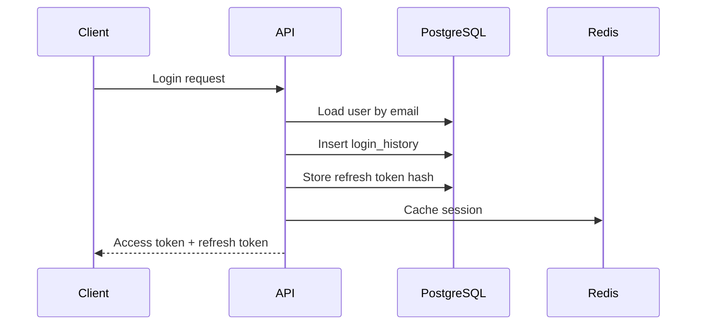
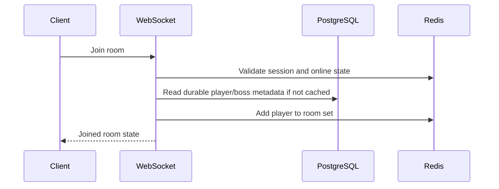
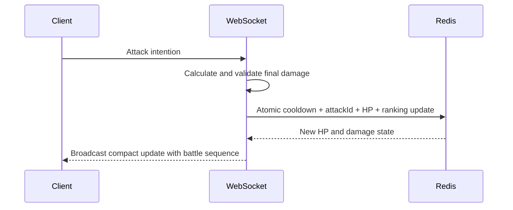
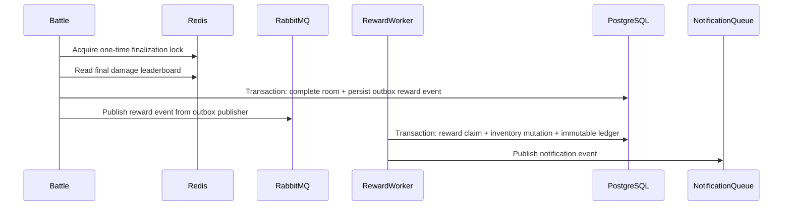
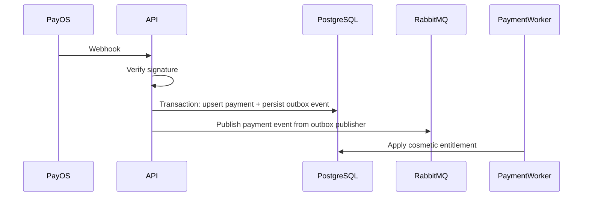
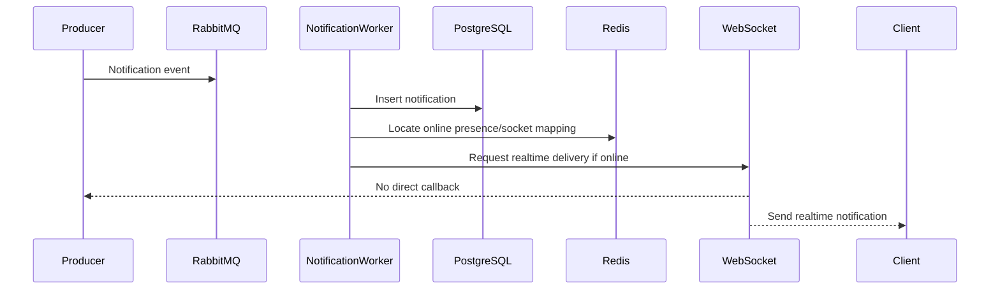

# Data Flow

## Player Login

PostgreSQL: user, login history, refresh token. Redis: active session cache and blacklist checks.

## Battle Join

PostgreSQL is read at room join only when metadata is not cached. Active room state lives in Redis.

## Attack Boss

No PostgreSQL. No RabbitMQ. No AI. Client damage is never trusted.

Atomic attack contract:

- Validate room membership and active room status.
- Validate boss is alive.
- Validate cooldown.
- Reject duplicate `attackId`.
- Apply server-calculated damage.
- Update `battle:room:{roomId}:boss:hp`.
- Update `battle:room:{roomId}:damage`.
- Increment battle sequence for reconciliation.

## Reward Distribution

Reward work is asynchronous and logically exactly-once through a durable idempotency key.

## Payment Success

Payment status must be idempotent and append-auditable.

## Notification

Persistent notification is stored in PostgreSQL. Redis only locates online presence; the WebSocket service sends realtime notifications.
