# ERD

```mermaid
erDiagram
    USERS ||--|| PLAYER_PROFILES : owns
    USERS ||--o{ REFRESH_TOKENS : has
    USERS ||--o{ LOGIN_HISTORY : records
    USERS ||--o{ USER_SESSIONS : has

    PLAYER_PROFILES ||--|| PLAYER_STATISTICS : has
    PLAYER_PROFILES ||--|| PLAYER_SETTINGS : has
    PLAYER_PROFILES ||--|| INVENTORIES : owns
    INVENTORIES ||--o{ INVENTORY_ITEMS : contains
    ITEMS ||--o{ INVENTORY_ITEMS : instanced_as
    ITEM_RARITIES ||--o{ ITEMS : classifies
    ITEM_TYPES ||--o{ ITEMS : classifies
    ITEMS ||--o{ ITEM_ATTRIBUTES : has
    PLAYER_PROFILES ||--o{ EQUIPMENT : equips
    INVENTORY_ITEMS ||--|| EQUIPMENT : equipped_as

    BOSSES ||--o{ BOSS_PHASES : has
    BOSSES ||--o{ BOSS_SKILLS : has
    BOSSES ||--o{ BATTLE_ROOMS : appears_in
    BATTLE_ROOMS ||--o{ BATTLE_HISTORY : summarizes
    BATTLE_ROOMS ||--o{ DAMAGE_LOGS : records
    PLAYER_PROFILES ||--o{ BATTLE_HISTORY : participates
    PLAYER_PROFILES ||--o{ DAMAGE_LOGS : deals

    SEASONS ||--o{ RANKINGS : contains
    PLAYER_PROFILES ||--o{ RANKINGS : ranked
    SEASONS ||--o{ LEADERBOARD_SNAPSHOTS : snapshots

    REWARDS ||--o{ REWARD_CLAIMS : claimed_as
    PLAYER_PROFILES ||--o{ REWARD_CLAIMS : receives
    REWARD_CLAIMS ||--o{ REWARD_LEDGER : records
    PLAYER_PROFILES ||--o{ REWARD_LEDGER : granted_to
    ITEMS ||--o{ REWARD_LEDGER : grants

    QUESTS ||--o{ PLAYER_QUESTS : assigned
    PLAYER_PROFILES ||--o{ PLAYER_QUESTS : progresses
    ACHIEVEMENTS ||--o{ PLAYER_ACHIEVEMENTS : unlocked_as
    PLAYER_PROFILES ||--o{ PLAYER_ACHIEVEMENTS : unlocks

    PLAYER_PROFILES ||--o{ GUILDS : owns
    GUILDS ||--o{ GUILD_MEMBERS : contains
    PLAYER_PROFILES ||--o{ GUILD_MEMBERS : joins

    PLAYER_PROFILES ||--o{ NOTIFICATIONS : receives
    PLAYER_PROFILES ||--o{ MAIL : receives
    ITEMS ||--o{ SHOP_ITEMS : sold_as
    PLAYER_PROFILES ||--o{ PAYMENT_TRANSACTIONS : pays
    USERS ||--o{ AUDIT_LOGS : performs
```

## Relationship Notes

- `users` to `player_profiles` is one-to-one. User authentication and player gameplay identity are separated for security and maintainability.
- `player_profiles` to `inventories` is one-to-one. Inventory capacity and ownership are isolated from profile fields.
- `inventories` to `inventory_items` is one-to-many. Items are definitions; inventory items are ownership records.
- `bosses` to `battle_rooms` is one-to-many. A boss definition can appear in many battle rooms.
- `battle_rooms` to `battle_history` is one-to-many. History is written after or around battle lifecycle, not per attack.
- `seasons` to `rankings` is one-to-many. Ranking is durable, while live leaderboard values are cached in Redis.
- `rewards` to `reward_claims` is one-to-many. Reward claim rows provide idempotency and auditability.
- `guilds` to `guild_members` is one-to-many. Initial design allows one active guild per player.
- `payment_transactions` are append-only ledger records and are never physically deleted.
- `reward_ledger` is immutable and records every granted reward side effect.
- `outbox_events` is a reliable publication table. It references aggregate identity by `(aggregate_type, aggregate_id)` and has no physical FK in the current design.
- `ai_generated_content` stores generation metadata only and has no physical FK to published domain definitions.

## Cardinality Summary

| Relationship | Cardinality | Delete Strategy |
| --- | --- | --- |
| User -> PlayerProfile | 1:1 | Soft delete user/profile |
| User -> RefreshToken | 1:N | Revoke tokens, no cascade delete |
| PlayerProfile -> Inventory | 1:1 | Restrict |
| Inventory -> InventoryItem | 1:N | Soft delete item ownership |
| Boss -> BossPhase | 1:N | Admin-controlled orphan removal |
| Boss -> BossSkill | 1:N | Admin-controlled orphan removal |
| BattleRoom -> BattleHistory | 1:N | Append-only |
| Season -> Ranking | 1:N | Restrict |
| PlayerProfile -> RewardClaim | 1:N | Append-only |
| Guild -> GuildMember | 1:N | Restrict or soft leave |
| PlayerProfile -> PaymentTransaction | 1:N | Append-only |
| RewardClaim -> RewardLedger | 1:N | Append-only |

## Completion And Publication Notes

- One battle room can be finalized once by an idempotent `battle_rooms` status transition.
- Reward publication is driven by `outbox_events`, not by volatile Redis state alone.
- RabbitMQ redelivery cannot duplicate rewards because `reward_claims` has a durable unique idempotency key and `reward_ledger` records immutable grants.

## Conceptual Relationships

These are non-FK relationships:

- `outbox_events.aggregate_type + outbox_events.aggregate_id` conceptually points to the aggregate that produced the event, such as a battle room or payment transaction.
- `ai_generated_content` may be promoted into domain definitions such as bosses, items, quests, or rewards only through a later approved publishing workflow.
- The physical ERD above contains only relationships backed by documented foreign keys.
